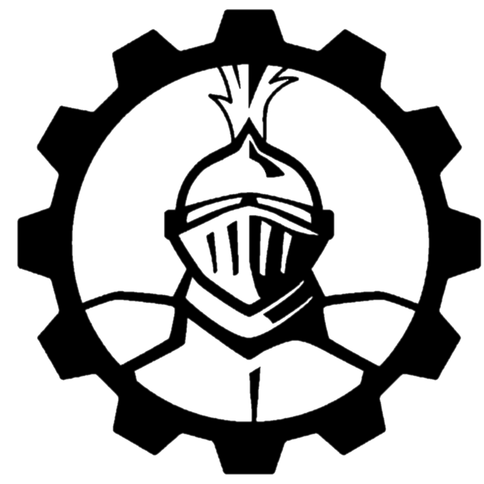

	
	<h1>Vision2020</h1>
	

		<b>📷 Source code for the 2020 vision program playing Infinite Recharge</b>
	

    
     
    
    
     
	 
	 
	 

## Contributing

Look at `CONTRIBUTING.md` for more information

## LICENSE

This project is licensed under the GPL-3.0

© 2020 Team 501 - The PowerKnights. Please see `LICENSE` for full license details.
